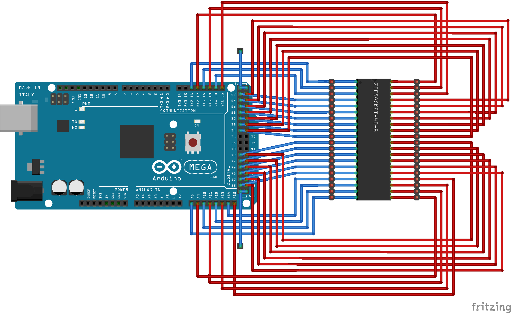
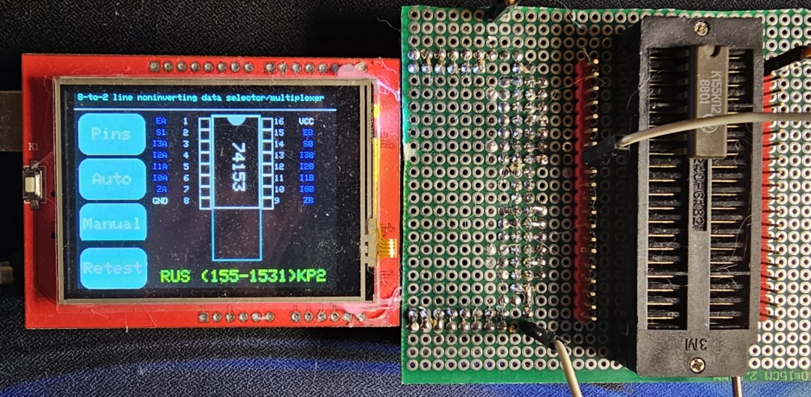
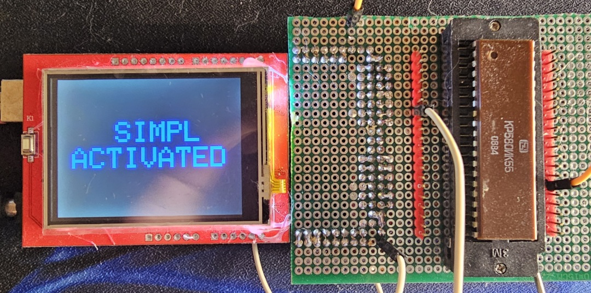

IC Tester for the classic CMOS and TLL ICs with Touch Display

It will be very useful who collects clones and analogues of the Zx Spectrum and similar vintage consoles)))

based code on Frank Hellmann, 2019 http://www.gotohellmann.com/ & original idea Akshay Bawejas http://www.akshaybaweja.com/ https://github.com/akshaybaweja/Smart-IC-Tester
Gorby75 https://github.com/Gorby75/Mega-IC-Tester
and SIMPL implementation by Ken Boak https://github.com/monsonite/SIMPL

## Features

### Autonomous mode
18,20 & 24 Pin ICs. The base contains 422 ICs. Russian analogues have been added to the database.

## PC mode 
40 pins ICs and some RAMs:
- 7489
- 4164
- 7489
- 8255А (USSR: K580VV55)
- 93410 (USSR: K155RU5)
- 2102А (USSR: K565RU2)

#### Custom Scripts
Besides the ready-made scripts, you can always write your own! The system supports custom testing scripts for 
specialized ICs or specific testing scenarios. You can create custom test patterns and sequences to extend the
functionality beyond the built-in database.

## Requirements

This project needs the Arduino IDE 2.3.8+

a Arduino Mega 2560 Module

a two pls-10 header (optional)
a two pls-1 header (optional)
a two female-to-female jumper wires (optional)

an ILI9341 240x320 Pixel RGB TFT LCD Touch Display Shield

minimum 1GB Micro-SD Card that fits the Display Shield, no up limits 

a 40pin ZIF Socket

About me
https://t.me/ulitka_garry

## Setting Up and Programming
Assembly Arduino and display, install all libraries and use Example->MCUFRIEND_kbv->diagnose_Touchpins to find out which
pins are connected to touch in you're display
Update IC_Tester.ino: 
```C++
const int XP = 6, XM = A2, YP = A1, YM = 7; //ID=0x9341`
```
according to previous step
Build and upload sketch to your Arduino Mega, check if display and touchscreen works correctly

Build hat with 
Format the SDCard as FAT/FAT32 Filesystem. Copy the database (database.txt) into the root folder of the SDCard. Plug the SDCard into the TFT shield and connect the Arduino Mega to the computer. Start the Arduino IDE. Check you have the following librarys installed (Tools -> Library Manager): MCUFRIEND_kbv (try the Adafruit_ILI9341 if the display doesn't work). Adafruit GFX Library (included the Bus Library as well). Adafruit Touchscreen. SD_patched (download from above, includes Arduino Mega Software SPI fix. Select the proper Arduino Mega 2560 under Tools -> Board -> Arduino AVR Boards. Select the correct COM port for upload. Compile and Upload the sketch. Enjoy

Sorry !!! Some elements may be incorrectly defined. I didn't have a certain number of items available to check. I took them from someone else's database. Write me what needs to be corrected or added and I will do it!





# PC tool
Pc tool allows you to test ICs using some variant of scripting language SIMPL. 

## Requirements:
- Full assembled device(IC Mega Tester)
- Windows of Linux PC
- Python 3.10+ installed

## Installing:

- Enter to PC_TEST directory using Command line interface
```Bash
python -m venv venv 
```
OR 
```Bash
python3 -m venv venv 
```
then activate venv:

In linux: 
```Bash
. venv/bin/activate
```

In windows:
```Bash
.\venv\Scripts\activate
```

then edit PC_TEST/base_test.py: set correct COM port name
```python
COM_PORT = "Here is you're com port"
```

then start .py file with test
for example:
```bash
python _4164.py
```
for test 4146 RAM

## Additional power
Connect additional GND and VCC with corresponding pins of ZIF-40 using a two female-to-female jumper wires and
additional PLS header on board, some IC requires it, some not